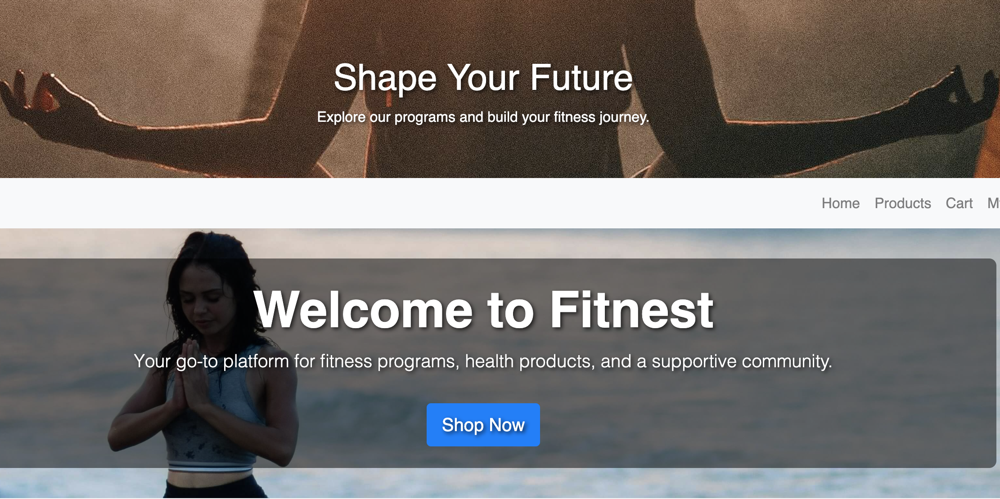
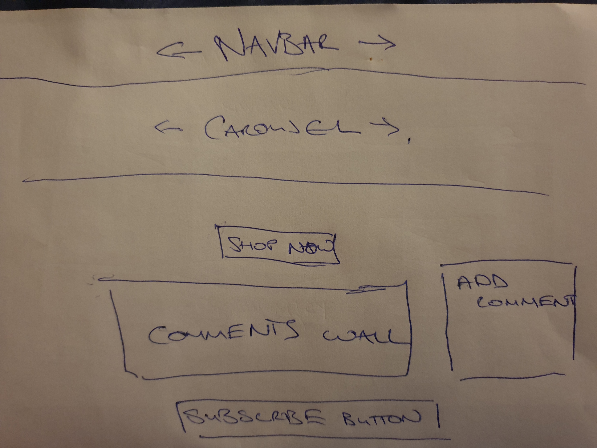
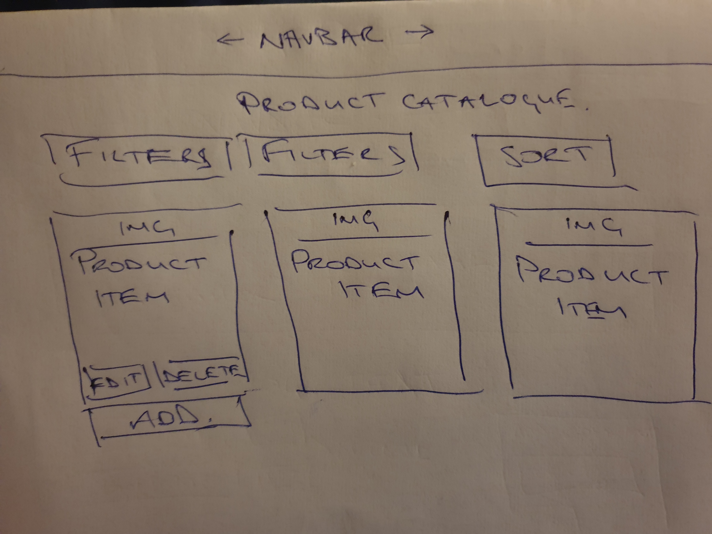
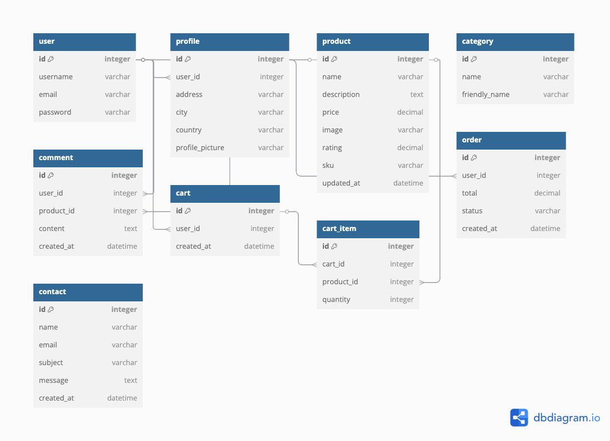
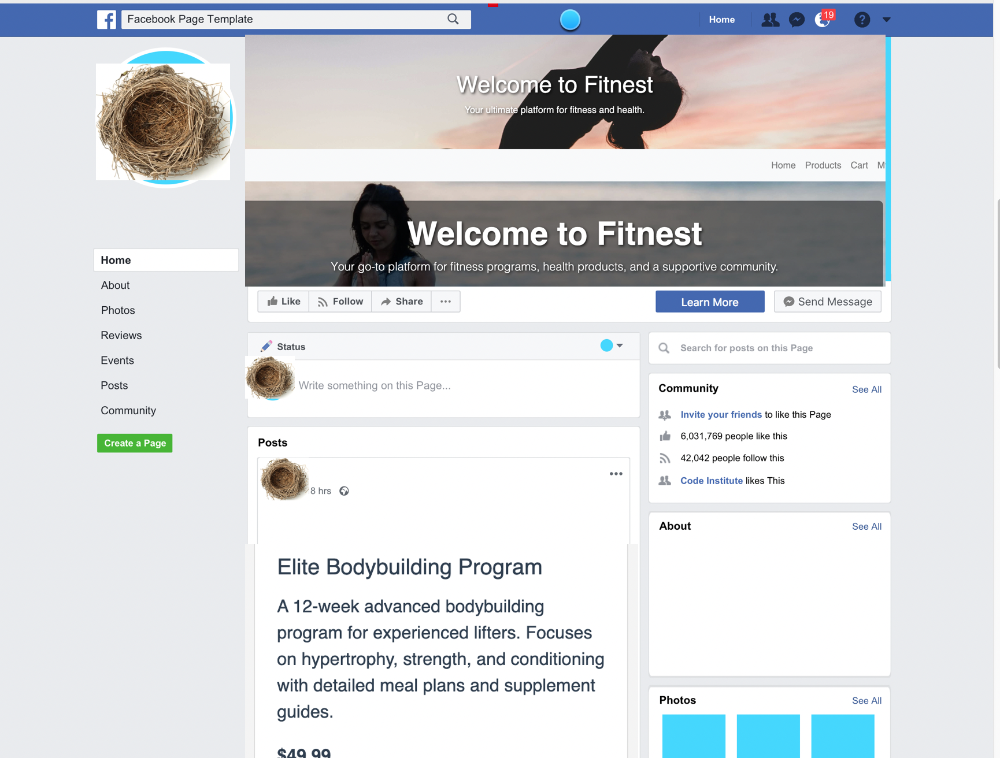
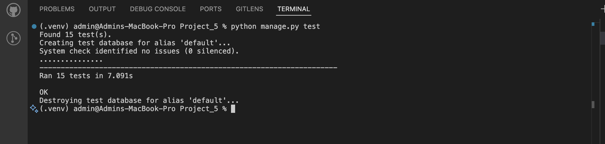
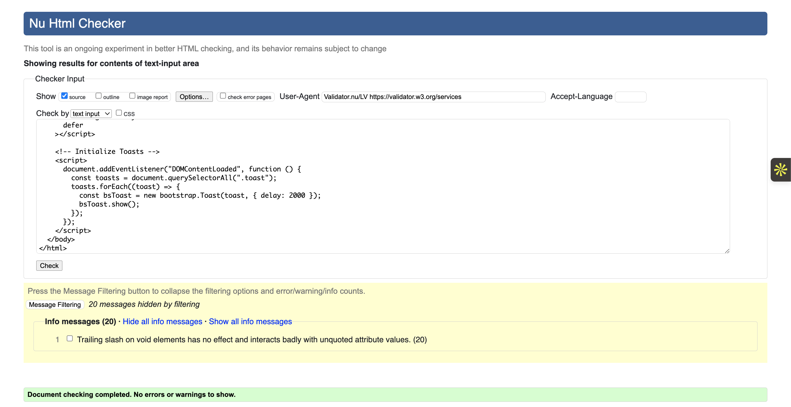
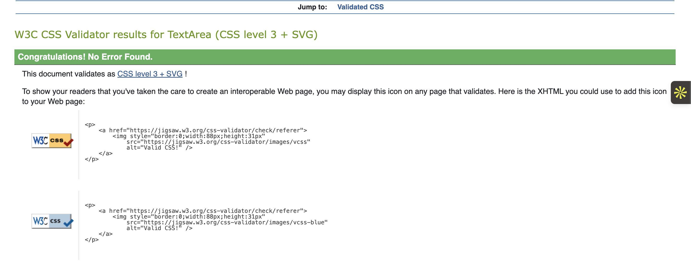
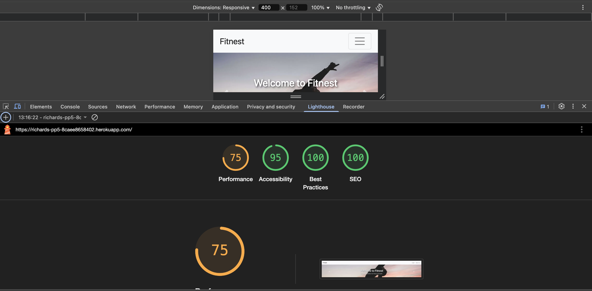

# Fitnest - Fitness E-Commerce Platform



> 💡 (Right-click or Ctrl+Click any link or image to open in a new tab.)

## Table of Contents
- [Live Site](#live-site)
- [Project Goals](#project-goals)
- [Project Intentions & Planning](#project-intentions-&-planning)
- [User Stories](#user-stories)
- [Agile Development & Wireframes](#agile-development)
- [Features](#features)
- [Facebook Business Page](#facebook-business-page)
- [Technologies Used](#technologies-used)
- [Testing](#testing)
- [Deployment](#deployment)
- [Credits](#credits)
- [Acknowledgements](#acknowledgements)

## Live Site
🌐 <a href="https://richards-pp5-8caee8658402.herokuapp.com/" target="_blank">Live Site: Fitnest</a>

## Project Goals
To create a comprehensive fitness e-commerce platform that:
- Provides an intuitive shopping experience
- Encourages community interaction
- Implements secure payment processing
- Maintains high performance standards
- Follows accessibility best practices

---

## Project Intentions & Planning

A detailed explanation of the **project goals, business model, and design choices** is documented in the following Google Doc:

📄 <a href="https://docs.google.com/document/d/1cNEtj40iuhMNrbCfl6m3x47SoImJv2XE/edit?usp=drive_link&ouid=116876224672419831524&rtpof=true&sd=true" target="_blank">Fitnest E-Commerce Project Documentation</a>

This document outlines the core concept of the Fitnest project, including:

- The business case and audience
- Core features and user stories
- Design decisions and layout wireframes
- Technologies and services used

It was created to support planning, testing, and assessment of the full-stack development process.


## User Stories
### Shopper Goals
- Browse and filter products by category
- Search for specific fitness items
- View detailed product information
- Add items to cart and checkout securely

### User Management
- Register and login securely
- Manage personal profile information
- View order history
- Logout securely

### Community Features
- Post comments on products
- Read other users' experiences
- Moderate comments (admin)

### Admin Functions
- Add/edit/delete products
- Manage inventory
- View all user comments
- Process orders

## Agile Development

This project was developed using the Agile methodology, tracked via GitHub Projects.

📋 [View the Agile Project Board](https://github.com/users/dickiegog/projects/9)

---

## Wireframes

Initial planning included hand-drawn wireframes for the homepage and product page.

### Home Page Wireframe

<a href="static/images/home_page.jpg" target="_blank">
  
</a>

### Product Page Wireframe

<a href="static/images/products_page.jpg" target="_blank">
  
</a>

## 🧩 Data Schema – Entity Relationship Diagram (ERD)

The following ER diagram illustrates the relationships between models in the project:

<a href="static/images/er-diagram.png" target="_blank">
  
</a>


> 💡 Right-click or Ctrl+Click any image to open in a new tab.


## Features

### Core Features
- **Responsive Product Catalog**
  - Category filtering
  - Keyword search
  - Sorting options
  - Pagination

- **User Authentication**
  - Secure registration/login
  - Password reset
  - Email verification
  - Profile management

- **Shopping Cart**
  - Add/remove items
  - Quantity adjustment
  - Persistent cart between sessions
  - Order summary, maintained, even after logout

- **Checkout Process**
  - Secure Stripe payments (needs to be changed to )
  - Order confirmation
  - Receipt generation

- **Community Interaction**
  - Product-specific comments
  - Comment moderation
  - User rating system

### Future Features
- View previous purchases (left in repo as an issue)
- Wishlist functionality 
- Enhanced admin dashboard
- Loyalty program integration
- VAT breakdown

## Facebook Business Page

Below is a mockup of the bespoke Facebook business page for this project:



## Technologies Used

### Frontend
- HTML5
- CSS3
- JavaScript (ES6)
- Bootstrap 4.6
- jQuery 3.5.1

### Backend
- Python 3.12
- Django 5.1
- Django AllAuth
- Django Crispy Forms

### Database
- SQLite (development)
- PostgreSQL (production)

### Services
- Stripe (payments)
- Cloudinary (media storage)
- Heroku (hosting)
- GitHub (version control)

### Development Tools
- Gitpod IDE
- Chrome DevTools
- Lighthouse
- W3C Validators

# Testing

## Automated Testing

Unit tests were written in `tests.py` to validate model integrity, views, and key application functionality.

Django's built-in test runner was used to execute the tests:

```bash
python manage.py test
```

All 15 tests passed successfully, confirming the core logic is functioning as expected.

<a href="staticfiles/images/Automated_testing.png" target="_blank">
  
</a>

### Manual Testing

Manual testing was performed for all major features, including:
- User registration, login, and profile editing
- Adding/removing items from cart
- Checkout and Stripe payment flow
- Order history and order detail navigation
- Responsive design on desktop and mobile

#### Manual Testing Table

| Feature         | Steps Taken                                   | Expected Outcome           | Actual Outcome           |
|-----------------|-----------------------------------------------|----------------------------|--------------------------|
| Add to Cart     | Click "Add to Cart" on product page           | Item appears in cart       | Works as expected        |
| Checkout        | Fill form, proceed to Stripe, pay             | Order saved, payment works | Works as expected        |
| Order History   | Visit profile > order history                 | Orders listed              | Works as expected        |
| Order Details   | Click "View" on order history                 | Order detail page loads    | Works as expected        |
| Edit Profile    | Change address, save                          | Address updated            | Works as expected        |
| Password Change    | Change password via profile/settings                    | Password updated, user notified         | Works as expected        |
| Logout             | Click logout button                                     | User is logged out, redirected to home  | Works as expected        |
| Home Button        | Click "Home" button/logo                                | User is taken to homepage               | Works as expected        |
| Navigation      | Use "Back to Shop" and "Back to Order History"| Navigation works           | Works as expected        |
| Responsive      | Resize browser/device                         | Layout adapts correctly    | Works as expected        |
| Contact Us      | Submit contact form with valid details        | Message saved/sent, user sees confirmation | Works as expected        |
| Newsletter Signup | Enter email and submit on newsletter form   | Email saved in backend, user sees confirmation | Works as expected        |
| Stripe Payment    | Use Stripe test card (e.g. 4242 4242 4242 4242) at checkout      | Payment succeeds, order marked as paid  | Works as expected        |
| Visit Facebook Page | Click "Visit our Facebook page" button    | Opens a mock Facebook page in a new tab | Works as expected        |

...

## Validation Testing

### HTML Validation

HTML was validated using [W3C Validator](https://validator.w3.org/).  
Every page was tested both by entering its live URL and by uploading the source code file to the validator.  
Only minor warnings were found, with no critical issues.



### CSS Validation

CSS was validated using [W3C CSS Validator](https://jigsaw.w3.org/css-validator/). No errors were detected.



### JavaScript Testing

- ✅ No console errors
- ✅ All interactive buttons and forms behave as expected

---

## Responsive Design

The site was tested across the following screen sizes:

- Mobile (iPhone SE, 12 Pro)
- Tablet (iPad)
- Laptop (MacBook Air)
- Desktop (1080p monitor)

The design adapted fluidly at each breakpoint.
- Laptop (MacBook Air)
- Desktop (1080p monitor)

The design adapted fluidly at each breakpoint.

## Performance Testing

Google Lighthouse was used to measure performance. The site scored well in all categories:



| Metric         | Score |
|----------------|-------|
| Performance    | 75    |
| Accessibility  | 94    |
| Best Practices | 96    |
| SEO            | 100   |

---

## Deployment

### Local Development

1. **Clone repository:**

   ```bash
   git clone https://github.com/dickiegog/Project_5.git
   ```

2. **Install requirements:**

   ```bash
   pip install -r requirements.txt
   ```

3. **Create environment variables:**

   ```python
   # env.py
   import os
   os.environ['SECRET_KEY'] = 'your-secret-key'
   os.environ['STRIPE_PUBLIC_KEY'] = 'your-stripe-key'
   os.environ['STRIPE_SECRET_KEY'] = 'your-stripe-secret'
   ```

4. **Migrate database:**

   ```bash
   python manage.py migrate
   ```

5. **Run development server:**

   ```bash
   python manage.py runserver
   ```

---

### Heroku Deployment

1. Create new Heroku app  
2. Add **PostgreSQL** add-on  
3. Set config vars:

   ```
   DATABASE_URL
   SECRET_KEY
   STRIPE_PUBLIC_KEY
   STRIPE_SECRET_KEY
   CLOUDINARY_URL
   ```

4. Connect GitHub repository  
5. Enable automatic deploys  
6. Deploy branch  

---

## Credits

### Media
- Product images from [Unsplash](https://unsplash.com)
- Icons from [Font Awesome](https://fontawesome.com)

### Code
- Base template adapted from **Code Institute Boutique Ado**
- Payment system based on [Stripe documentation](https://stripe.com/docs)
- [Django AllAuth](https://django-allauth.readthedocs.io/en/latest/) for authentication

### Acknowledgements
- Code Institute tutors and mentors  
- Mentor reviewers  
- Unsplash photographers

---

**License**: This project is developed for educational purposes as part of Code Institute's Full Stack Developer program.
